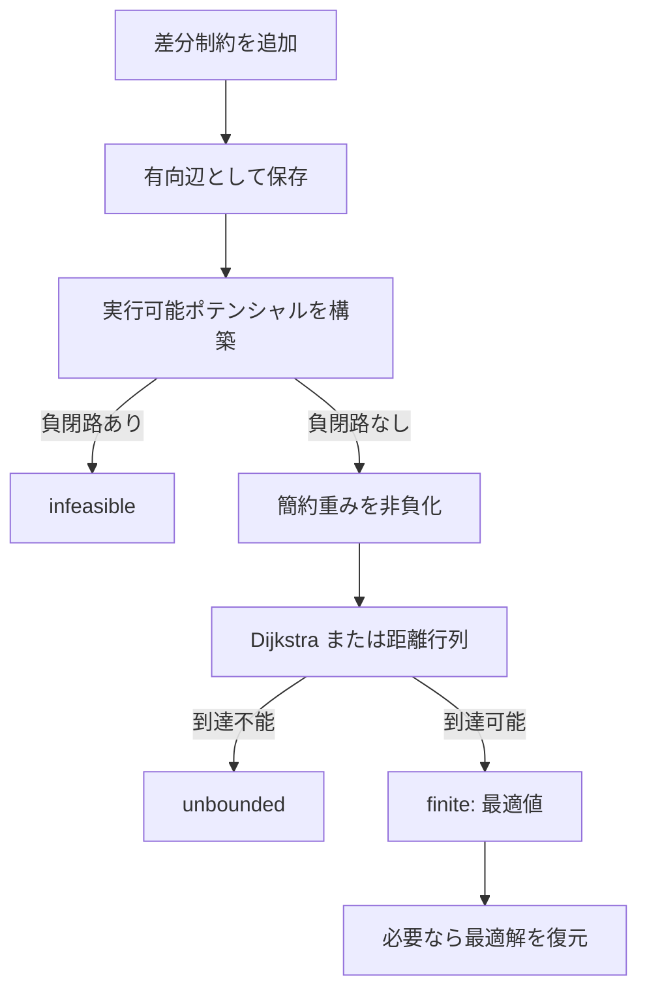

# 差分制約系ライブラリ 詳細ガイド

このガイドは、Bellman–Ford 法や Floyd–Warshall 法は知っているものの、差分制約系、いわゆる「牛ゲー」をまだ使ったことがない人を対象にしています。

対象となるライブラリには、同じ公開 API を持つ次の4構造体が含まれています。

- `difference_constraints_bellman_ford`
- `difference_constraints_scc_bellman_ford`
- `difference_constraints_spfa`
- `difference_constraints_floyd_warshall`

扱える制約、問い合わせ結果、使い方は4実装で共通です。違うのは、主に実行可能性を調べ、実行可能なポテンシャルを作る方法です。

## 目次

1. [最初に要点](#1-最初に要点)
2. [差分制約系とは](#2-差分制約系とは)
3. [不等式を有向辺へ変換する](#3-不等式を有向辺へ変換する)
4. [なぜ負閉路があると実行不可能なのか](#4-なぜ負閉路があると実行不可能なのか)
5. [なぜ差の最大値が最短路になるのか](#5-なぜ差の最大値が最短路になるのか)
6. [有限・非有界・実行不可能の違い](#6-有限非有界実行不可能の違い)
7. [定数を表す ZERO 頂点](#7-定数を表す-zero-頂点)
8. [ライブラリ全体の構成](#8-ライブラリ全体の構成)
9. [テンプレート引数と結果型](#9-テンプレート引数と結果型)
10. [最初の使用例](#10-最初の使用例)
11. [制約追加メソッド](#11-制約追加メソッド)
12. [問い合わせメソッド](#12-問い合わせメソッド)
13. [疎グラフ3実装に共通する処理](#13-疎グラフ3実装に共通する処理)
14. [基本 Bellman–Ford 版](#14-基本-bellmanford-版)
15. [SCC Bellman–Ford 版](#15-scc-bellmanford-版)
16. [SPFA 版](#16-spfa-版)
17. [Floyd–Warshall 版](#17-floydwarshall-版)
18. [最適解の復元方法](#18-最適解の復元方法)
19. [典型ユースケース](#19-典型ユースケース)
20. [使える条件・使えない条件](#20-使える条件使えない条件)
21. [実装の選び方](#21-実装の選び方)
22. [計算量一覧](#22-計算量一覧)
23. [オーバーフローと型の選択](#23-オーバーフローと型の選択)
24. [よくある間違い](#24-よくある間違い)
25. [public API 一覧](#25-public-api-一覧)

## 1. 最初に要点

差分制約系が扱う基本形は、次の不等式です。

$$
x_v-x_u\leq w
$$

式を移項すると、

$$
x_v\leq x_u+w
$$

です。この形は、最短路の緩和条件

```cpp
dist[v] <= dist[u] + w
```

と同じです。そこで、制約1本を次の有向辺1本へ置き換えます。

```text
u -> v, weight = w
```

この変換をすべての制約へ行うと、次の事実が得られます。

- グラフ全体に負閉路があるなら、全制約を同時に満たす値は存在しない
- 負閉路がなければ、少なくとも1つの実行可能解を作れる
- 実行可能で、`s` から `t` へ到達可能なら、`x[t] - x[s]` の最大値は `s -> t` 最短路長
- 実行可能だが `s` から `t` へ到達不能なら、`x[t] - x[s]` は上に非有界
- 最小値は向きを逆にして、最大値の符号を反転すればよい

最も重要な対応は、次の1行です。

```cpp
dc.add_upper_bound(u, v, w); // x[v] - x[u] <= w、すなわち u -> v に重み w
```

## 2. 差分制約系とは

差分制約系は、複数の変数の「差」に対する上限または下限を同時に扱う問題です。

例えば、次の条件を考えます。

$$
\begin{aligned}
x_1-x_0 &\leq 5\\
x_1-x_0 &\geq 2\\
x_2-x_1 &=3
\end{aligned}
$$

これは、

- `x[1]` は `x[0]` より2以上5以下だけ大きい
- `x[2]` は `x[1]` よりちょうど3大きい

という意味です。

このとき、

$$
5\leq x_2-x_0\leq 8
$$

です。ライブラリでは次のように書けます。

```cpp
difference_constraints_bellman_ford<long long> dc(3);
dc.add_bounds(0, 1, 2, 5);
dc.add_equal(1, 2, 3);

auto range = dc.difference_bounds(0, 2);
// range.lower == 5
// range.upper == 8
```

「差分制約」という名前から等式だけを想像しやすいですが、中心になるのは不等式です。等式は、上限と下限を同時に課した特殊ケースです。

## 3. 不等式を有向辺へ変換する

### 3.1 上限制約

次の制約を考えます。

$$
x_v-x_u\leq w
$$

移項すると、

$$
x_v\leq x_u+w
$$

なので、`u -> v` に重み `w` の辺を張ります。

```cpp
dc.add_upper_bound(u, v, w);
```

内部処理は、そのまま次の形です。

```cpp
void add_upper_bound(int from, int to, Weight upper) {
    add_edge(from, to, upper);
}
```

引数順 `from, to` と、有向辺の向きが一致しています。

### 3.2 下限制約

次の制約は、そのままでは基本形の `<=` ではありません。

$$
x_v-x_u\geq l
$$

両辺へマイナスを掛けると、

$$
x_u-x_v\leq -l
$$

になります。したがって、辺の向きを反転し、重みも符号反転します。

```text
v -> u, weight = -l
```

ライブラリの実装も同じです。

```cpp
void add_lower_bound(int from, int to, Weight lower) {
    add_edge(to, from, static_cast<Weight>(-static_cast<Calc>(lower)));
}
```

下限制約で符号や向きを間違えることが、差分制約系で最も多いミスです。

### 3.3 区間、等式、絶対値

差が区間に入るという条件は、上限と下限の2本に分けます。

$$
l\leq x_v-x_u\leq r
$$

```cpp
dc.add_bounds(u, v, l, r);
```

等式も同様です。

$$
x_v-x_u=d
$$

```cpp
dc.add_equal(u, v, d);
```

絶対値の上限は、差の区間です。

$$
|x_v-x_u|\leq d
\iff
-d\leq x_v-x_u\leq d
$$

```cpp
dc.add_abs_upper_bound(u, v, d);
```

内部では、いずれも基本形を組み合わせています。

```cpp
void add_bounds(int from, int to, Weight lower, Weight upper) {
    add_upper_bound(from, to, upper);
    add_lower_bound(from, to, lower);
}

void add_equal(int from, int to, Weight difference) {
    add_bounds(from, to, difference, difference);
}

void add_abs_upper_bound(int from, int to, Weight limit) {
    add_bounds(from, to, -limit, limit);
}
```

## 4. なぜ負閉路があると実行不可能なのか

頂点列

$$
v_0\to v_1\to\dots\to v_k=v_0
$$

からなる閉路を考えます。各辺の制約を足し合わせると、左辺は途中の変数が打ち消し合います。

$$
\begin{aligned}
x_{v_1}-x_{v_0} &\leq w_0\\
x_{v_2}-x_{v_1} &\leq w_1\\
&\vdots\\
x_{v_0}-x_{v_{k-1}} &\leq w_{k-1}
\end{aligned}
$$

合計は、

$$
0\leq w_0+w_1+\dots+w_{k-1}
$$

です。

もし閉路の重みの合計が負なら、

$$
0\leq -1
$$

のような矛盾になります。したがって、負閉路が1つでも存在すれば、変数をどのように選んでも全制約を満たせません。

重要なのは、「問い合わせの始点から到達できる負閉路だけ」ではなく、「グラフのどこかにある負閉路すべて」を検出する必要があることです。別の連結成分に負閉路があっても、制約全体は実行不可能です。

そのため基本版では、特定の始点だけを距離0にするのではなく、全頂点のポテンシャルを0で初期化します。これは、すべての頂点へ重み0の辺を張る超始点を追加したことと同じです。

```cpp
potential.assign(vertex_count, Calc{});
```

逆に、負閉路がなければ実行可能解を必ず作れます。すべての頂点へ重み0の辺を持つ超始点 `q` を追加し、`q` からの最短距離を `d[v]` とします。どの頂点にも到達でき、負閉路もないので距離は有限です。

任意の制約辺 `u -> v, w` について、最短距離の性質から、

$$
d[v]\leq d[u]+w
$$

です。そこで `x[v] = d[v]` と置けば、すべての差分制約を満たします。

したがって、

$$
\text{差分制約系が実行可能}
\quad\Longleftrightarrow\quad
\text{制約グラフに負閉路がない}
$$

が成り立ちます。

## 5. なぜ差の最大値が最短路になるのか

`s` から `t` への任意のパスを考えます。

```text
s = v0 -> v1 -> ... -> vk = t
```

各辺の制約を足すと、

$$
x_t-x_s\leq w(v_0,v_1)+w(v_1,v_2)+\dots+w(v_{k-1},v_k)
$$

となります。つまり、すべての `s -> t` パスの長さが `x[t] - x[s]` の上限です。

すべてのパス上限を満たすには、最も小さいパス長、すなわち最短路長以下でなければなりません。

$$
x_t-x_s\leq \operatorname{dist}(s,t)
$$

一方、負閉路がなく `t` へ到達可能なら、この最短路長を実際に達成する変数割り当ても構成できます。したがって、単なる上界ではなく最大値そのものです。

$$
\max(x_t-x_s)=\operatorname{dist}(s,t)
$$

ここで重要なのは、差分制約の目的関数が「最短化」ではなく「差の最大化」である点です。

```cpp
auto result = dc.maximum_difference(s, t);
```

最小値は、向きを逆にして考えます。

$$
\min(x_t-x_s)
=-\max(x_s-x_t)
$$

```cpp
auto result = dc.minimum_difference(s, t);
```

実装もこの式をそのまま使っています。

```cpp
bound_result result = maximum_difference_internal(to, from);
if (result.state == status::finite) result.value = -result.value;
```

## 6. 有限・非有界・実行不可能の違い

問い合わせ結果は、次の3状態を区別します。

```cpp
enum class status {
    infeasible,
    unbounded,
    finite,
};
```

### `infeasible`

制約グラフのどこかに負閉路があり、全制約を同時に満たす値が存在しません。

この場合、目的関数だけを考える以前に問題全体が矛盾しています。

### `unbounded`

制約全体には実行可能解がありますが、`from` から `to` へのパスがありません。

`from` から到達可能な頂点集合を $R$ とします。`R` から外部へ出る辺があれば、その頂点も到達可能になるため、`R` から外部への辺はありません。

そこで、`R` の外側にある変数をすべて同じだけ大きくしても、制約は壊れません。`to` が外側なら、`x[to] - x[from]` をいくらでも大きくできます。

### `finite`

制約全体が実行可能で、`from` から `to` へ到達可能です。`value` に有限の最適値が入ります。

結果の読み方は次のとおりです。

```cpp
using DC = difference_constraints_scc_bellman_ford<long long>;
using Status = DC::status;

DC dc(n);
// 制約を追加

auto result = dc.maximum_difference(s, t);
if (result.state == Status::infeasible) {
    // 制約全体が矛盾
} else if (result.state == Status::unbounded) {
    // x[t] - x[s] をいくらでも大きくできる
} else {
    std::cout << result.value << '\n';
}
```

`value` を参照してよいのは `status::finite` のときだけです。

## 7. 定数を表す ZERO 頂点

差分だけを含む制約は、全変数へ同じ定数を足しても変わりません。

$$
(x_v+c)-(x_u+c)=x_v-x_u
$$

そのため、通常の差分制約グラフだけでは「`x[v] <= 10`」のような絶対値の条件を直接表せません。

このライブラリは、ユーザー変数 `0, 1, ..., n-1` に加えて、内部に `ZERO` 頂点 `n` を1個持ちます。

```cpp
int n;
int vertex_count; // n + 1
int zero_vertex;  // n
```

`x[v] <= upper` は、

$$
x_v-x_{ZERO}\leq upper
$$

として登録します。

```cpp
void add_upper_bound(int variable, Weight upper) {
    add_edge(zero_vertex, variable, upper);
}
```

`x[v] >= lower` は、

$$
x_{ZERO}-x_v\leq -lower
$$

です。

```cpp
void add_lower_bound(int variable, Weight lower) {
    add_edge(variable, zero_vertex, -lower);
}
```

求めた解は最後に `ZERO` の値を全変数から引き、`ZERO == 0` となるよう正規化します。

```cpp
const Calc base = potential[zero_vertex];
for (int v = 0; v < n; ++v) {
    values[v] = potential[v] - base;
}
```

したがって、利用者は内部頂点を意識せず、次のように書けます。

```cpp
dc.add_upper_bound(v, 10); // x[v] <= 10
dc.add_lower_bound(v, 3);  // 3 <= x[v]
dc.add_equal(v, 7);        // x[v] == 7
```

入力重みが整数なら、Bellman–Ford、Dijkstra、Floyd–Warshall の加算と比較だけで解を作るため、返される実行可能解と有限最適値も整数です。実数線形計画ソルバーや丸め処理は必要ありません。

## 8. ライブラリ全体の構成

ライブラリの処理は、大きく次の流れになっています。



4構造体の役割は次のとおりです。

| 構造体 | 実行可能性の判定 | 最適値の問い合わせ |
|---|---|---|
| `difference_constraints_bellman_ford` | 全辺走査 Bellman–Ford | 簡約重み + Dijkstra |
| `difference_constraints_scc_bellman_ford` | SCCごとの Bellman–Ford | 簡約重み + Dijkstra |
| `difference_constraints_spfa` | SPFA | 簡約重み + Dijkstra |
| `difference_constraints_floyd_warshall` | Floyd–Warshall の負の対角成分 | 全点対最短距離を直接参照 |

疎グラフ3実装は、実行可能性を一度調べた後、同じキャッシュを利用します。制約追加後はキャッシュを破棄し、次の問い合わせ時に再計算します。

```cpp
void invalidate() {
    solved = false;
    feasible_cache = false;
    graph.clear();
    potential.clear();
}
```

Floyd–Warshall 版は全点対距離を持っているため、初回構築後の制約追加を $O(V^2)$ で反映します。

## 9. テンプレート引数と結果型

### 9.1 `Weight` と `Calc`

各構造体は次のテンプレート引数を持ちます。

```cpp
template <class Weight = long long, class Calc = Weight>
struct difference_constraints_bellman_ford;
```

- `Weight`: 各制約辺の重みを保存する型
- `Calc`: ポテンシャル、経路長、簡約重み、復元値を計算する型

通常は次で十分です。

```cpp
difference_constraints_scc_bellman_ford<long long> dc(n);
```

1辺の重みは `long long` に収まるものの、長い経路の合計が収まらない可能性があるなら、計算型だけを広げます。

```cpp
difference_constraints_scc_bellman_ford<long long, __int128_t> dc(n);
```

### 9.2 `bound_result`

最大値または最小値の問い合わせ結果です。

```cpp
struct bound_result {
    status state = status::infeasible;
    Calc value{};
};
```

| `state` | 意味 | `value` |
|---|---|---|
| `infeasible` | 制約全体が矛盾 | 無効 |
| `unbounded` | 目的関数が非有界 | 無効 |
| `finite` | 有限の最適値あり | 有効 |

### 9.3 `bounds_result`

差または変数値の上下限をまとめて返します。

```cpp
struct bounds_result {
    bool feasible = false;
    std::optional<Calc> lower;
    std::optional<Calc> upper;
};
```

- `feasible == false`: 制約全体が矛盾
- `lower == nullopt`: 下に非有界、すなわち $-\infty$
- `upper == nullopt`: 上に非有界、すなわち $+\infty$
- 値あり: その側の有限な限界

例えば、

```cpp
auto range = dc.difference_bounds(u, v);
if (!range.feasible) {
    // 制約が矛盾
} else {
    if (range.lower) std::cout << "lower = " << *range.lower << '\n';
    if (range.upper) std::cout << "upper = " << *range.upper << '\n';
}
```

### 9.4 `solution_result`

最適値に加えて、その値を実際に達成する全変数の割り当てを返します。

```cpp
struct solution_result {
    status state = status::infeasible;
    Calc value{};
    std::vector<Calc> values;
};
```

`state == finite` のときだけ、

- `value`: 最適値
- `values[v]`: その最適値を達成する `x[v]`

が有効です。`infeasible` または `unbounded` のとき、`values` は空です。

## 10. 最初の使用例

3変数に次の条件を課します。

$$
\begin{aligned}
x_0 &=0\\
2\leq x_1-x_0&\leq5\\
x_2-x_1&=3
\end{aligned}
$$

```cpp
#include <bits/stdc++.h>
#include <atcoder/scc>

// ライブラリ本体をここへコピペ

int main() {
    using DC = difference_constraints_scc_bellman_ford<long long>;
    using Status = DC::status;

    DC dc(3);
    dc.reserve_edges(6);
    dc.add_equal(0, 0LL);
    dc.add_bounds(0, 1, 2LL, 5LL);
    dc.add_equal(1, 2, 3LL);

    if (!dc.feasible()) {
        std::cout << "infeasible\n";
        return 0;
    }

    auto range = dc.difference_bounds(0, 2);
    std::cout << *range.lower << ' ' << *range.upper << '\n'; // 5 8

    auto maximum = dc.maximum_difference_solution(0, 2);
    if (maximum.state == Status::finite) {
        std::cout << maximum.value << '\n'; // 8
        for (long long value : maximum.values) std::cout << value << ' ';
        std::cout << '\n';
    }
}
```

どの実装を使うかは、型名を変えるだけです。

```cpp
using DC = difference_constraints_bellman_ford<long long>;
using DC = difference_constraints_scc_bellman_ford<long long>;
using DC = difference_constraints_spfa<long long>;
using DC = difference_constraints_floyd_warshall<long long>;
```

実際には上のうち1行だけを選びます。

## 11. 制約追加メソッド

### 11.1 コンストラクタ

```cpp
explicit difference_constraints_...(int n);
```

ユーザー変数 `x[0]` から `x[n-1]` を作ります。内部では定数を表す `ZERO` 頂点も1つ追加されるため、グラフの実頂点数は `n + 1` です。

```cpp
difference_constraints_spfa<long long> dc(n);
```

疎グラフ3版の構築は $O(n)$、Floyd–Warshall 版は距離行列を初期化するため $O(n^2)$ です。

### 11.2 `size()`

```cpp
int size() const;
```

内部 `ZERO` 頂点を含まない、ユーザー変数の個数 `n` を返します。

```cpp
DC dc(100);
assert(dc.size() == 100);
```

### 11.3 `reserve_edges()`

```cpp
void reserve_edges(std::size_t expected_edges);
```

疎グラフ3版で、内部の辺配列を事前確保します。再確保を減らしたい場合に使います。

予約するのは「メソッド呼び出し回数」ではなく「最終的に作られる有向辺数」です。

| 追加メソッド | 内部辺数 |
|---|---:|
| `add_upper_bound` | 1 |
| `add_lower_bound` | 1 |
| `add_bounds` | 2 |
| `add_equal` | 2 |
| `add_abs_upper_bound` | 2 |

定数に対するオーバーロードも同じ本数です。

```cpp
DC dc(n);
dc.reserve_edges(static_cast<std::size_t>(2 * m));
```

Floyd–Warshall 版では距離行列へ直接保存するため、このメソッドは何もしません。API差し替え互換性のために用意されています。

### 11.4 `add_upper_bound(from, to, upper)`

```cpp
void add_upper_bound(int from, int to, Weight upper);
```

追加する条件は、

$$
x_{to}-x_{from}\leq upper
$$

です。

```cpp
dc.add_upper_bound(u, v, 10); // x[v] - x[u] <= 10
```

内部では `from -> to`、重み `upper` の辺を1本追加します。

### 11.5 `add_lower_bound(from, to, lower)`

```cpp
void add_lower_bound(int from, int to, Weight lower);
```

追加する条件は、

$$
lower\leq x_{to}-x_{from}
$$

です。

```cpp
dc.add_lower_bound(u, v, 4); // x[v] >= x[u] + 4
```

内部辺は `to -> from`、重み `-lower` です。

### 11.6 `add_bounds(from, to, lower, upper)`

```cpp
void add_bounds(int from, int to, Weight lower, Weight upper);
```

$$
lower\leq x_{to}-x_{from}\leq upper
$$

を追加します。

```cpp
dc.add_bounds(u, v, 3, 8);
```

上限辺と下限辺の2本を追加します。`lower > upper` を渡すと、その矛盾は負閉路として検出されます。

### 11.7 `add_equal(from, to, difference)`

```cpp
void add_equal(int from, int to, Weight difference);
```

$$
x_{to}-x_{from}=difference
$$

を追加します。

```cpp
dc.add_equal(u, v, 7); // x[v] == x[u] + 7
```

内部では、同じ値を上下限として `add_bounds()` を呼びます。

### 11.8 `add_abs_upper_bound(from, to, limit)`

```cpp
void add_abs_upper_bound(int from, int to, Weight limit);
```

$$
|x_{to}-x_{from}|\leq limit
$$

を追加します。

```cpp
dc.add_abs_upper_bound(i, i + 1, max_change);
```

数列の隣接差、時刻のずれ、座標の近さなどで頻出します。内部では `[-limit, limit]` の区間制約へ変換します。

### 11.9 変数単体の上限

```cpp
void add_upper_bound(int variable, Weight upper);
```

$$
x_{variable}\leq upper
$$

を追加します。

```cpp
dc.add_upper_bound(v, 100);
```

内部では、`ZERO -> variable` に重み `upper` の辺を追加します。

### 11.10 変数単体の下限

```cpp
void add_lower_bound(int variable, Weight lower);
```

$$
lower\leq x_{variable}
$$

を追加します。

```cpp
dc.add_lower_bound(v, 0);
```

内部では、`variable -> ZERO` に重み `-lower` の辺を追加します。

### 11.11 変数単体の範囲

```cpp
void add_bounds(int variable, Weight lower, Weight upper);
```

$$
lower\leq x_{variable}\leq upper
$$

を追加します。

```cpp
dc.add_bounds(v, 0, 100);
```

### 11.12 変数単体の固定

```cpp
void add_equal(int variable, Weight value);
```

$$
x_{variable}=value
$$

を追加します。

```cpp
dc.add_equal(0, 0LL); // x[0] を0へ固定
```

整数リテラルだけで呼ぶとオーバーロード選択が分かりにくく見える場合があるため、`Weight=long long` なら `0LL` と書くと意図が明確です。

## 12. 問い合わせメソッド

### 12.1 `feasible()`

```cpp
bool feasible();
```

全制約を同時に満たす変数割り当てが存在するか返します。

```cpp
if (!dc.feasible()) {
    std::cout << "No solution\n";
}
```

疎グラフ版では負閉路検出と実行可能ポテンシャル構築を行い、結果をキャッシュします。制約を追加しない限り、2回目以降は $O(1)$ です。

Floyd–Warshall 版では全点対最短距離を構築し、`distance[v][v] < 0` となる頂点がないか調べます。

### 12.2 `feasible_assignment()`

```cpp
std::optional<std::vector<Calc>> feasible_assignment();
```

任意の実行可能解を1つ返します。矛盾している場合は `nullopt` です。

```cpp
auto assignment = dc.feasible_assignment();
if (!assignment) {
    std::cout << "infeasible\n";
} else {
    for (auto value : *assignment) std::cout << value << ' ';
}
```

返されるのは最適解とは限りません。単に、すべての制約を満たす1つの割り当てです。

内部では、実行可能ポテンシャル `potential[v]` から `potential[ZERO]` を引いて正規化します。

### 12.3 `maximum_difference(from, to)`

```cpp
bound_result maximum_difference(int from, int to);
```

$$
\max(x_{to}-x_{from})
$$

を返します。

```cpp
auto result = dc.maximum_difference(s, t);
```

- 負閉路あり: `infeasible`
- `from -> to` 到達不能: `unbounded`
- 到達可能: `finite` で最短路長

### 12.4 `minimum_difference(from, to)`

```cpp
bound_result minimum_difference(int from, int to);
```

$$
\min(x_{to}-x_{from})
$$

を返します。

内部では、`maximum_difference(to, from)` を求めて符号反転します。

### 12.5 `difference_bounds(from, to)`

```cpp
bounds_result difference_bounds(int from, int to);
```

`x[to] - x[from]` が取り得る範囲をまとめて返します。

```cpp
auto range = dc.difference_bounds(from, to);
```

上限は `from -> to` 最短路、下限は `to -> from` 最短路の符号反転です。

```cpp
upper = maximum_difference(from, to);
lower = -maximum_difference(to, from);
```

どちらかの方向へ到達不能なら、その側だけ `nullopt` になります。

### 12.6 `maximum_value(variable)`

```cpp
bound_result maximum_value(int variable);
```

`ZERO == 0` として、`x[variable]` の最大値を返します。

内部的には、

```cpp
maximum_difference_internal(zero_vertex, variable);
```

です。`ZERO -> variable` へ到達不能なら上に非有界です。

### 12.7 `minimum_value(variable)`

```cpp
bound_result minimum_value(int variable);
```

`x[variable]` の最小値を返します。

内部的には、`variable -> ZERO` に対する最大差を求め、符号反転します。

### 12.8 `value_bounds(variable)`

```cpp
bounds_result value_bounds(int variable);
```

`x[variable]` が取り得る下限・上限をまとめて返します。

```cpp
auto range = dc.value_bounds(v);
```

### 12.9 `maximum_difference_solution(from, to)`

```cpp
solution_result maximum_difference_solution(int from, int to);
```

`x[to] - x[from]` の最大値と、その最大値を達成する全変数の値を返します。

```cpp
auto solution = dc.maximum_difference_solution(s, t);
if (solution.state == DC::status::finite) {
    assert(solution.values[t] - solution.values[s] == solution.value);
}
```

単に最適値だけが必要なら、`maximum_difference()` の方が返り値のコピーが少なく、意図も明確です。

### 12.10 `minimum_difference_solution(from, to)`

```cpp
solution_result minimum_difference_solution(int from, int to);
```

最小値と、それを達成する全変数の値を返します。内部では逆向きの最大化問題を復元し、目的値だけを符号反転します。変数割り当て自体は、そのまま最小値を達成しています。

### 12.11 `maximum_value_solution(variable)`

```cpp
solution_result maximum_value_solution(int variable);
```

`x[variable]` の最大値と、それを達成する解を返します。内部始点は `ZERO` です。

### 12.12 `minimum_value_solution(variable)`

```cpp
solution_result minimum_value_solution(int variable);
```

`x[variable]` の最小値と、それを達成する解を返します。内部では `variable -> ZERO` の最大差を求めて復元します。

## 13. 疎グラフ3実装に共通する処理

基本 Bellman–Ford 版、SCC Bellman–Ford 版、SPFA 版は、実行可能ポテンシャルの作り方だけが異なります。その後の問い合わせ処理は同じです。

### 13.1 実行可能ポテンシャル

各頂点へ値 `potential[v]` を割り当て、すべての辺 `u -> v, w` に対して、

$$
potential[v]\leq potential[u]+w
$$

を満たすようにします。

これは、そのまま元の差分制約を満たす変数割り当てです。

$$
potential[v]-potential[u]\leq w
$$

したがって、`potential` を1つ求められれば、実行可能解も得られます。

### 13.2 簡約重み

実行可能ポテンシャル `h[v] = potential[v]` が得られたとします。各辺の重みを次のように変換します。

$$
w'(u,v)=w(u,v)+h[u]-h[v]
$$

実行可能性より、

$$
h[v]\leq h[u]+w(u,v)
$$

なので、

$$
w'(u,v)\geq0
$$

です。つまり、元のグラフに負辺があっても、実行可能ポテンシャルが得られた後なら、全辺を非負へ変換できます。

ライブラリのコードは次のとおりです。

```cpp
const Calc reduced_weight =
    static_cast<Calc>(edge.weight) +
    potential[edge.from] - potential[edge.to];
```

これにより、最適値問い合わせごとに Bellman–Ford をやり直さず、Dijkstra 法を使えます。

### 13.3 簡約しても最短路が保たれる理由

パス

$$
v_0=s\to v_1\to\dots\to v_k=t
$$

の簡約重みを合計すると、ポテンシャル項が途中で打ち消し合います。

$$
\begin{aligned}
\sum w'(v_i,v_{i+1})
&=\sum\left(w(v_i,v_{i+1})+h[v_i]-h[v_{i+1}]\right)\\
&=\sum w(v_i,v_{i+1})+h[s]-h[t]
\end{aligned}
$$

同じ `s, t` を結ぶすべてのパスへ同じ `h[s] - h[t]` が加わるだけなので、どのパスが最短かは変わりません。

簡約グラフの距離を $d'(s,t)$、元の距離を $d(s,t)$ とすると、

$$
d'(s,t)=d(s,t)+h[s]-h[t]
$$

したがって、

$$
d(s,t)=d'(s,t)+h[t]-h[s]
$$

です。

実装も同じ式です。

```cpp
const Calc value = distance[to] + potential[to] - potential[from];
```

### 13.4 `reduced_distances()`

簡約重み上で、指定始点から Dijkstra 法を実行します。

```cpp
std::vector<Calc> reduced_distances(int source) const {
    std::vector<Calc> distance(vertex_count, infinity());
    using QueueEntry = std::pair<Calc, int>;
    std::priority_queue<QueueEntry,
                        std::vector<QueueEntry>,
                        std::greater<QueueEntry>> queue;

    distance[source] = 0;
    queue.emplace(0, source);

    while (!queue.empty()) {
        auto [current_distance, from] = queue.top();
        queue.pop();
        if (distance[from] != current_distance) continue;

        for (int edge_id : graph[from]) {
            const Edge& edge = edges[edge_id];
            const Calc reduced_weight =
                static_cast<Calc>(edge.weight) +
                potential[edge.from] - potential[edge.to];
            const Calc candidate = current_distance + reduced_weight;
            if (distance[edge.to] <= candidate) continue;
            distance[edge.to] = candidate;
            queue.emplace(candidate, edge.to);
        }
    }
    return distance;
}
```

到達不能頂点は `infinity()` のままなので、`unbounded` の判定にも使えます。

## 14. 基本 Bellman–Ford 版

構造体名は次のとおりです。

```cpp
difference_constraints_bellman_ford<Weight, Calc>
```

ACLへ依存せず、最も単純で予測しやすい実装です。

### 14.1 全頂点を0で初期化する意味

通常の単一始点最短路では、始点だけを0、他を無限大にします。しかし、差分制約ではグラフのどこにある負閉路も検出しなければなりません。

そこで、全頂点へ重み0の辺を持つ超始点を仮想的に追加します。実装上は、全頂点を0で初期化するだけで同じ効果が得られます。

```cpp
potential.assign(vertex_count, Calc{});
```

### 14.2 緩和処理

```cpp
bool updated = false;
for (int iteration = 0; iteration < vertex_count; ++iteration) {
    updated = false;
    for (const Edge& edge : edges) {
        const Calc candidate =
            potential[edge.from] + static_cast<Calc>(edge.weight);
        if (potential[edge.to] <= candidate) continue;
        potential[edge.to] = candidate;
        updated = true;
    }
    if (!updated) break;
}
```

更新が止まれば、すべての辺について、

$$
potential[to]\leq potential[from]+weight
$$

が成立しています。したがって `potential` は実行可能解です。

### 14.3 負閉路判定

負閉路がないなら、単純路の辺数は高々 `V - 1` なので、`V` 回目の走査まで更新が続くことはありません。

```cpp
feasible_cache = !updated;
```

`V` 回目にも更新されたなら負閉路ありです。

### 14.4 特徴

- 最悪計算量 $O(VE)$
- 辺順がよければ早期終了しやすい
- 小規模問題、基準実装、他実装との比較に向く
- ACLを使えない環境でも、`<bits/stdc++.h>` と構造体本体だけで使える

## 15. SCC Bellman–Ford 版

構造体名は次のとおりです。

```cpp
difference_constraints_scc_bellman_ford<Weight, Calc>
```

この構造体だけは、ACL の `atcoder::scc_graph` を使います。

```cpp
#include <atcoder/scc>
```

### 15.1 なぜSCCに分けられるのか

閉路に含まれる頂点は、互いに行き来できます。したがって、すべて同じ強連結成分に属します。

負閉路も閉路なので、必ず1つのSCC内に完全に収まります。成分間の辺だけでは閉路を作れません。

この性質により、グラフ全体で Bellman–Ford を行う代わりに、各SCCの内部辺だけを調べられます。

### 15.2 SCCの構築と辺の分類

```cpp
atcoder::scc_graph scc_graph(vertex_count);
for (const Edge& edge : edges) {
    scc_graph.add_edge(edge.from, edge.to);
}
auto groups = scc_graph.scc();
```

各辺を、

- 同じSCC内を結ぶ `internal_edges`
- 別SCCへ進む `outgoing_edges`

へ分けます。

```cpp
if (component[edge.from] == component[edge.to]) {
    internal_edges[component[edge.from]].push_back(edge_id);
} else {
    outgoing_edges[component[edge.from]].push_back(edge_id);
}
```

### 15.3 各SCC内の実行可能性

各成分 $C$ について、内部辺だけで Bellman–Ford を行います。

```cpp
for (int iteration = 0; iteration < component_size; ++iteration) {
    updated = false;
    for (int edge_id : internal_edges[component_id]) {
        const Edge& edge = edges[edge_id];
        const Calc candidate = potential[edge.from] + edge.weight;
        if (potential[edge.to] <= candidate) continue;
        potential[edge.to] = candidate;
        updated = true;
    }
    if (!updated) break;
}
```

成分サイズ回目にも更新されたなら、そのSCC内に負閉路があります。

### 15.4 成分間のオフセット

各SCC内で求めた局所ポテンシャルを $p[v]$ とします。同じ成分内の全頂点へ同じ値 $c_C$ を加えても、内部の差は変わりません。

最終ポテンシャルを、

$$
h[v]=p[v]+c_{component(v)}
$$

とします。

成分 $C$ の頂点 `u` から、成分 $D$ の頂点 `v` への辺 `u -> v, w` に対して必要なのは、

$$
p[v]+c_D\leq p[u]+c_C+w
$$

です。整理すると、

$$
c_D\leq c_C+p[u]+w-p[v]
$$

になります。

ACLの `scc()` が返す成分はトポロジカル順です。したがって、前からこの上限を伝播できます。

```cpp
const Calc candidate =
    component_offset[from_component] +
    potential[edge.from] + edge.weight - potential[edge.to];

component_offset[to_component] =
    std::min(component_offset[to_component], candidate);
```

最後に局所ポテンシャルと成分オフセットを足します。

```cpp
for (int v = 0; v < vertex_count; ++v) {
    potential[v] += component_offset[component[v]];
}
```

### 15.5 計算量と性質

各SCCを $C$ とすると、実行可能性判定の計算量は、

$$
O\left(V+E+\sum_C |V_C||E_C|\right)
$$

です。

- DAGなら各SCCはほぼ1頂点なので、実行可能性判定はほぼ $O(V+E)$
- 小さなSCCが多数あるグラフでも大きく改善しやすい
- 全体が1つの巨大SCCなら、最悪計算量は基本版と同じ $O(VE)$
- SCC構築分の定数コストがあるため、常に基本版より速いわけではない

「最悪計算量を必ず漸近的に改善する方法」ではなく、「決定的な計算量保証を保ちながら、SCC構造を利用して不要な全辺走査を減らす方法」です。

## 16. SPFA 版

構造体名は次のとおりです。

```cpp
difference_constraints_spfa<Weight, Calc>
```

更新が発生した頂点から出る辺だけを調べるため、平均的には基本 Bellman–Ford より速くなることがあります。

### 16.1 負辺の始点だけを初期キューへ入れる

初期ポテンシャルはすべて0です。

```cpp
potential.assign(vertex_count, Calc{});
```

この時点で制約

$$
potential[to]\leq potential[from]+w
$$

は、

$$
0\leq w
$$

です。したがって、最初から違反し得るのは負辺だけです。

そのため、全頂点ではなく、負辺の始点だけを初期キューへ入れます。

```cpp
for (const Edge& edge : edges) {
    if (edge.weight >= 0 || in_queue[edge.from]) continue;
    in_queue[edge.from] = 1;
    queue.push_back(edge.from);
}
```

負辺が1本もなければ、すべて0がすでに実行可能解です。

### 16.2 更新頂点だけを処理する

```cpp
while (!queue.empty()) {
    int from = queue.front();
    queue.pop_front();
    in_queue[from] = 0;

    for (int edge_id : graph[from]) {
        const Edge& edge = edges[edge_id];
        Calc candidate = potential[edge.from] + edge.weight;
        if (potential[edge.to] <= candidate) continue;
        potential[edge.to] = candidate;
        // edge.to を必要ならキューへ追加
    }
}
```

全辺を毎回走査せず、値が変わった頂点の出辺だけを再調査します。

### 16.3 SLF

SLF は Small Label First の略です。新しくキューへ入れる頂点の値が、現在の先頭頂点より小さければ、deque の前へ入れます。

```cpp
if (!queue.empty() && potential[to] < potential[queue.front()]) {
    queue.push_front(to);
} else {
    queue.push_back(to);
}
```

小さいポテンシャルを早く伝播させ、後から同じ頂点を何度も更新する回数を減らす狙いです。順序を変えるだけなので、正しさには影響しません。

### 16.4 負閉路検出

更新された値が何本の辺からなる経路によって得られたかを `path_length` に持ちます。

```cpp
path_length[to] = path_length[from] + 1;
if (path_length[to] >= vertex_count) {
    return false;
}
```

`V` 本以上の辺を持つ改善経路には頂点の重複があり、その改善を生む負閉路が含まれます。

### 16.5 計算量と注意点

- 最悪計算量は $O(VE)$
- 非敵対的で、更新が局所的な疎グラフでは高速になりやすい
- DAGに近いグラフでも高速になりやすい
- わずかな改善が広範囲へ何度も伝播する入力では遅くなり得る
- 入力からSPFAの実行時間を確実に予測することは難しい

最悪ケース耐性が必要ならSCC版、平均速度を優先するならSPFA版、という使い分けになります。

## 17. Floyd–Warshall 版

構造体名は次のとおりです。

```cpp
difference_constraints_floyd_warshall<Weight, Calc>
```

頂点数が小さい、グラフが密、全点対の差を多数問い合わせる、構築後も制約を追加する、といった場合に向きます。

### 17.1 距離行列への登録

距離行列は1次元配列で保持します。

```cpp
std::size_t index(int from, int to) const {
    return static_cast<std::size_t>(from) * vertex_count + to;
}
```

初期値は、

- `distance[v][v] = 0`
- それ以外は無限大

です。制約辺は同じ頂点対の最小重みだけを残します。

```cpp
distance[from][to] = std::min(distance[from][to], weight);
```

### 17.2 実行可能性判定

通常の Floyd–Warshall 法で全点対最短距離を作ります。

```cpp
for (int k = 0; k < vertex_count; ++k) {
    for (int i = 0; i < vertex_count; ++i) {
        const Calc left = distance[i][k];
        if (left == infinity()) continue;
        for (int j = 0; j < vertex_count; ++j) {
            const Calc right = distance[k][j];
            if (right == infinity()) continue;
            distance[i][j] = std::min(
                distance[i][j],
                left + right);
        }
    }
}
```

負閉路があれば、その閉路上の頂点 `v` について、

$$
distance[v][v]<0
$$

になります。

```cpp
for (int v = 0; v < vertex_count; ++v) {
    if (distance[v][v] < 0) return false;
}
```

### 17.3 問い合わせ

実行可能なら、

```cpp
maximum_difference(from, to) == distance[from][to]
```

です。無限大なら到達不能なので `unbounded` です。

下限は逆向き距離の符号反転です。

$$
\min(x_{to}-x_{from})=-distance[to][from]
$$

### 17.4 構築後の制約追加

全点対距離が完成した後に、新しい辺

```text
from -> to, weight
```

を追加したとします。

新しい辺を使う最短路は、

```text
i ... from -> to ... j
```

という形です。負閉路が新たにできない限り、新辺を2回以上使う必要はありません。

したがって、

$$
d_{new}[i][j]
=\min\left(
d[i][j],
d[i][from]+weight+d[to][j]
\right)
$$

で更新できます。

実装では、更新途中の値を再利用しないよう、更新前の `d[i][from]` と `d[to][j]` を一度コピーします。

```cpp
std::vector<Calc> distance_to_from(vertex_count);
std::vector<Calc> distance_from_to(vertex_count);
for (int v = 0; v < vertex_count; ++v) {
    distance_to_from[v] = distance[v][from];
    distance_from_to[v] = distance[to][v];
}

for (int i = 0; i < vertex_count; ++i) {
    if (distance_to_from[i] == infinity()) continue;
    for (int j = 0; j < vertex_count; ++j) {
        if (distance_from_to[j] == infinity()) continue;
        distance[i][j] = std::min(
            distance[i][j],
            distance_to_from[i] + weight + distance_from_to[j]);
    }
}
```

計算量は1辺追加あたり $O(V^2)$ です。

新辺が負閉路を作る条件は、既存の `to -> from` 最短路と合わせた重みが負になることです。

$$
d[to][from]+weight<0
$$

### 17.5 Floyd版の実行可能ポテンシャル

解の復元には、Floyd版でも実行可能ポテンシャルが必要です。

全頂点へ重み0で到達できる超始点からの最短距離は、各列の最小値で得られます。

$$
h[v]=\min\left(0,\min_u d[u][v]\right)
$$

実装では `potential` を0で初期化し、すべての `distance[from][to]` で最小化しています。

```cpp
potential.assign(vertex_count, 0);
for (int from = 0; from < vertex_count; ++from) {
    for (int to = 0; to < vertex_count; ++to) {
        potential[to] = std::min(potential[to], distance[from][to]);
    }
}
```

## 18. 最適解の復元方法

最適値だけなら最短路長を返せばよいですが、`maximum_difference_solution()` は、その値を達成する全変数の値も返します。

ここでは疎グラフ版の復元を説明します。

### 18.1 到達可能頂点

実行可能ポテンシャルを $h[v]$、簡約グラフでの `source` からの最短距離を $\delta[v]$ とします。

`source` から到達可能な頂点について、

$$
x[v]=h[v]+\delta[v]
$$

と置きます。

簡約辺 `u -> v` の重みを $w'(u,v)$ とすると、最短距離の性質から、

$$
\delta[v]\leq\delta[u]+w'(u,v)
$$

です。元の重みとの関係を戻せば、この `x` は制約を満たします。

そして `source` 自身の簡約距離は0なので、対象 `target` について、

$$
x[target]-x[source]
=h[target]+\delta[target]-h[source]
$$

となり、元の最短路長、すなわち最大値を達成します。

### 18.2 到達不能頂点

到達不能頂点は $\delta[v]=\infty$ なので、そのまま使えません。

到達可能頂点の簡約距離の最大値を、

$$
C=\max_{v:\ reachable}\delta[v]
$$

とし、到達不能頂点にはすべて同じオフセット $C$ を与えます。

```cpp
Calc unreachable_offset = 0;
for (Calc value : distance) {
    if (value != infinity()) {
        unreachable_offset = std::max(unreachable_offset, value);
    }
}
```

```cpp
const Calc offset = distance[v] == infinity()
                        ? unreachable_offset
                        : distance[v];
all_values[v] = potential[v] + offset;
```

これで制約を満たす理由を、辺の種類ごとに確認します。

1. 到達可能頂点から到達不能頂点への辺は存在しない
   - その辺があれば、行き先も到達可能になるため
2. 到達可能頂点間
   - 最短距離の三角不等式で満たす
3. 到達不能頂点間
   - 両方へ同じ $C$ を足すので差は変わらず、簡約重みが非負なので満たす
4. 到達不能頂点から到達可能頂点
   - 到達可能側の $\delta[v]\leq C$ であり、簡約重みも非負なので満たす

### 18.3 ZEROによる正規化

最後に、内部 `ZERO` 頂点の値を全頂点から引きます。

```cpp
const Calc base = all_values[zero_vertex];
for (int v = 0; v < n; ++v) {
    values[v] = all_values[v] - base;
}
```

全変数を同じだけ平行移動しても差分制約と目的値は変わらないため、正しさは保たれます。

Floyd–Warshall 版では、元の距離 $d(source,v)$ を、

$$
\delta[v]=d(source,v)+h[source]-h[v]
$$

によって簡約距離へ変換してから、同じ復元処理を行います。

## 19. 典型ユースケース

### 19.1 累積和と区間和制約

数列 `a[0], ..., a[n-1]` の累積和を、

$$
P_i=\sum_{k=0}^{i-1}a_k
$$

とします。半開区間 `[l, r)` の和は、

$$
\sum_{k=l}^{r-1}a_k=P_r-P_l
$$

です。

したがって、区間和制約

$$
L\leq\sum_{k=l}^{r-1}a_k\leq R
$$

は、

```cpp
dc.add_bounds(l, r, L, R);
```

で表せます。

数列の各要素にも範囲があるなら、

$$
lower_i\leq a_i=P_{i+1}-P_i\leq upper_i
$$

なので、

```cpp
for (int i = 0; i < n; ++i) {
    dc.add_bounds(i, i + 1, lower[i], upper[i]);
}
```

です。

全体像は次のようになります。

```cpp
using DC = difference_constraints_scc_bellman_ford<long long>;
DC dc(n + 1); // P[0] ... P[n]
dc.add_equal(0, 0LL);

for (auto [l, r, lower, upper] : interval_constraints) {
    dc.add_bounds(l, r, lower, upper);
}

for (int i = 0; i < n; ++i) {
    dc.add_bounds(i, i + 1, min_value[i], max_value[i]);
}

auto total_range = dc.difference_bounds(0, n);
```

0/1列なら、

```cpp
dc.add_bounds(i, i + 1, 0LL, 1LL);
```

とすれば、区間内の選択個数に対する上下限制約を扱えます。

### 19.2 スケジューリングと先行制約

作業 `v` は、作業 `u` の開始から `duration` 以上後に開始しなければならないとします。

$$
start_v-start_u\geq duration
$$

```cpp
dc.add_lower_bound(u, v, duration);
```

開始時刻0を基準にし、各作業の最早開始時刻を求める例です。

```cpp
using DC = difference_constraints_scc_bellman_ford<long long>;
DC dc(job_count);
dc.add_equal(0, 0LL);

for (auto [before, after, duration] : precedence) {
    dc.add_lower_bound(before, after, duration);
}

auto earliest = dc.minimum_value(target_job);
```

締切もあるなら、

```cpp
dc.add_upper_bound(job, deadline);
```

を追加できます。

なお、先行関係がDAGで、単純な最早時刻だけを求めるなら最長路DPの方が直接的です。差分制約系の利点は、上限、下限、等式、閉路を含む相互制約を同じ形で扱えることです。

### 19.3 数列の平滑化

各値に上下限があり、隣接値の変化量も制限される問題です。

$$
L_i\leq a_i\leq R_i
$$

$$
|a_{i+1}-a_i|\leq D
$$

```cpp
using DC = difference_constraints_scc_bellman_ford<long long>;
DC dc(n);

for (int i = 0; i < n; ++i) {
    dc.add_bounds(i, lower[i], upper[i]);
}
for (int i = 0; i + 1 < n; ++i) {
    dc.add_abs_upper_bound(i, i + 1, max_change);
}

auto assignment = dc.feasible_assignment();
```

変数の1つや2変数の差を最大化したい場合も、そのまま問い合わせられます。

### 19.4 座標・レイアウト

物体 `u` の右側へ物体 `v` を置き、必要な間隔が `gap` であるなら、

$$
position_v-position_u\geq gap
$$

です。

```cpp
dc.add_lower_bound(u, v, gap);
```

距離の上限もあるなら、

```cpp
dc.add_bounds(u, v, min_gap, max_gap);
```

とできます。

非重複条件が「`u` が左か `v` が左か」の二択なら、順序を先に固定しない限り差分制約だけでは表せません。選言が必要になるためです。

### 19.5 時刻差の整合性

イベント間の時刻差について、

- 最低待ち時間
- 最大待ち時間
- 同時刻
- 絶対ずれの上限
- 各イベントの開始可能時間帯

を同時に管理できます。

```cpp
dc.add_lower_bound(a, b, min_wait);
dc.add_upper_bound(a, b, max_wait);
dc.add_equal(c, d, offset);
dc.add_abs_upper_bound(e, f, tolerance);
dc.add_bounds(g, release_time, deadline);
```

これは、Simple Temporal Network と呼ばれるモデルと同じ形です。

### 19.6 等式制約の混在

不等式に加えて、

$$
x_v-x_u=d
$$

が一部混ざる場合は `add_equal()` でよいです。

```cpp
dc.add_equal(u, v, d);
```

ただし、すべての制約が等式だけなら、ポテンシャル付き Union-Find の方が、ほぼ線形時間でオンライン追加にも対応でき、通常は適しています。

### 19.7 最小費用流の双対ポテンシャル

最小費用流の最適な残余グラフでは、各残余辺 `u -> v` の費用 `w` に対して、

$$
p_v-p_u\leq w
$$

を満たすポテンシャルを考えられます。

```cpp
for (const auto& edge : residual_edges) {
    dc.add_upper_bound(edge.from, edge.to, edge.cost);
}

auto potential = dc.feasible_assignment();
```

残余グラフに負閉路がなければ、実行可能な双対ポテンシャルを1つ復元できます。

## 20. 使える条件・使えない条件

### 20.1 そのまま使える条件

次を満たす問題は、差分制約系を検討できます。

- 各制約に現れる変数が高々2個
- 係数が一方 `+1`、他方 `-1`
- 定数との大小関係に直せる
- 目的関数が1変数の値、または2変数の差
- 実行可能性だけを知りたい
- 実行可能な割り当てを1つ欲しい
- 差の最大値、最小値、上下限を知りたい

代表形は次のとおりです。

$$
x_v-x_u\leq c
$$

$$
x_v-x_u\geq c
$$

$$
l\leq x_v-x_u\leq r
$$

$$
x_v-x_u=c
$$

$$
|x_v-x_u|\leq c
$$

### 20.2 変換すれば使える条件

整数変数に対する狭義不等式は、1ずらせます。

$$
x_v-x_u<c
\iff
x_v-x_u\leq c-1
$$

```cpp
dc.add_upper_bound(u, v, c - 1);
```

区間和は累積和を導入すると差になります。

単一変数の上限・下限・固定値は、内部 `ZERO` 頂点によって差へ変換されます。

### 20.3 そのままでは使えない条件

次の条件は、一般には差分制約ではありません。

- $x_i+x_j\leq c$
- $2x_i-x_j\leq c$
- $x_ix_j\leq c$
- $\max(x_i,x_j)\leq c$
- $|x_i-x_j|\geq d$
- 「AまたはB」のような選言
- 任意の重み付き総和を目的関数にする問題
- 制約の削除を含む完全動的問題

`|x_i-x_j| >= d` は、

$$
x_i-x_j\geq d
\quad\text{または}\quad
x_j-x_i\geq d
$$

という二択です。片方を事前に決められないなら、差分制約だけでは扱えません。

### 20.4 判断チェックリスト

問題を見たら、次の順に確認します。

1. 値、座標、時刻、累積和などを変数として置けるか
2. 各条件を `x[v] - x[u] <= c` へ変形できるか
3. 下限制約は向きと符号を反転すればよいか
4. 区間和なら累積和を導入できるか
5. 目的関数が `x[t] - x[s]` または単一変数になっているか
6. 選言、積、一般係数が混ざっていないか
7. 結果として実行不可能・非有界があり得るか

## 21. 実装の選び方

### 基本 Bellman–Ford 版を選ぶ場合

- ACLに依存したくない
- 頂点数・辺数が小さい
- 最も単純な基準実装が欲しい
- 辺順が良く、少ない反復で収束すると分かっている

```cpp
using DC = difference_constraints_bellman_ford<long long>;
```

### SCC Bellman–Ford 版を選ぶ場合

- ACLを利用できる
- グラフがDAGに近い
- 小さなSCCが多数ある
- SPFAの入力依存性を避けたい
- 構造を利用した決定的な改善を優先したい

```cpp
using DC = difference_constraints_scc_bellman_ford<long long>;
```

### SPFA 版を選ぶ場合

- 入力が非敵対的
- 更新が局所的
- 疎グラフ
- 平均速度を優先したい
- 最悪時に遅くなる可能性を受け入れられる

```cpp
using DC = difference_constraints_spfa<long long>;
```

### Floyd–Warshall 版を選ぶ場合

- 頂点数が小さい
- 辺が密
- 多数の頂点対を問い合わせる
- 制約追加後も全点対問い合わせを繰り返す
- $O(V^2)$ メモリを許容できる

```cpp
using DC = difference_constraints_floyd_warshall<long long>;
```

ライブラリ全体をそのままコンパイルする場合は、SCC版が含まれるため ACL が必要です。基本版またはSPFA版の `struct` だけを切り出せば、ACLは不要です。

## 22. 計算量一覧

ここで、内部 `ZERO` 頂点を含む頂点数を $V=n+1$、内部有向辺数を $E$ とします。

### 22.1 実装別

| 実装 | 初回実行可能性 | その後の1始点問い合わせ | メモリ |
|---|---:|---:|---:|
| 基本 Bellman–Ford | $O(VE)$ | $O((V+E)\log V)$ | $O(V+E)$ |
| SCC Bellman–Ford | $O(V+E+\sum_C|V_C||E_C|)$ | $O((V+E)\log V)$ | $O(V+E)$ |
| SPFA | 最悪 $O(VE)$ | $O((V+E)\log V)$ | $O(V+E)$ |
| Floyd–Warshall | $O(V^3)$ | $O(1)$ | $O(V^2)$ |

疎グラフ版の `difference_bounds()` は、両方向についてDijkstraを1回ずつ行います。漸近計算量は同じですが、定数倍は約2回分です。

疎グラフ版はDijkstra結果を始点ごとにはキャッシュしません。同じ始点から多数の終点へ問い合わせる用途では、現在のAPIでは問い合わせごとにDijkstraを行います。そのような全点対・多数問い合わせが中心で頂点数も小さいなら、Floyd–Warshall版が適しています。

### 22.2 制約追加後

| 実装 | 制約追加 | 次回問い合わせ |
|---|---:|---:|
| 疎グラフ3版 | 償却 $O(1)$ | 実行可能性から再計算 |
| Floyd構築前 | $O(1)$ | 初回 $O(V^3)$ |
| Floyd構築後 | $O(V^2)$ | $O(1)$ |

制約は追加しかできません。削除はサポートしていません。

## 23. オーバーフローと型の選択

このライブラリは競技プログラミング向けで、オーバーフロー検査を行いません。

### 23.1 `Weight` に収まる必要がある値

- 入力する各上限・下限
- 下限制約を変換した `-lower`
- 絶対値制約を変換した `-limit`

特に、`std::numeric_limits<Weight>::min()` の符号反転は同じ型に収まりません。

### 23.2 `Calc` に収まる必要がある値

- 経路重みの和
- Bellman–FordやSPFAのポテンシャル
- SCC間オフセット
- 簡約重み
- Dijkstra距離
- 最適解復元時のオフセットと変数値
- Floyd–Warshall の距離和

1辺の絶対値上限を $W$ とすると、単純路だけでも大まかに $(V-1)W$ 程度まで増える可能性があります。さらに実装中にはポテンシャル差も取るため、十分な余裕が必要です。

通常は、

```cpp
using DC = difference_constraints_scc_bellman_ford<long long>;
```

でよく、合計だけが `long long` を超える可能性があるなら、

```cpp
using DC = difference_constraints_scc_bellman_ford<long long, __int128_t>;
```

とします。

## 24. よくある間違い

### 24.1 下限制約の向きを反転し忘れる

$$
x_v-x_u\geq l
$$

は `u -> v, l` ではありません。

正しくは、

$$
x_u-x_v\leq-l
$$

なので、`v -> u, -l` です。

迷ったら、自分で辺を作らず、

```cpp
dc.add_lower_bound(u, v, l);
```

を使います。

### 24.2 「最大値なのに最短路」を取り違える

辺のパス長は、`x[t] - x[s]` の上限です。最も厳しい上限が最短路なので、差の最大値が最短路になります。

### 24.3 負閉路と非有界を同じものと考える

- 負閉路: 制約そのものが矛盾
- 到達不能: 制約は満たせるが、目的関数を上へ制限するパスがない

意味がまったく異なります。

### 24.4 始点から到達可能な負閉路しか調べない

目的関数と無関係な成分に負閉路があっても、制約全体は実行不可能です。このライブラリは全成分を調べます。

### 24.5 `nullopt` の意味を逆にする

`bounds_result` では、

- `lower == nullopt` は $-\infty$
- `upper == nullopt` は $+\infty$

です。制約矛盾は `feasible == false` で区別します。

### 24.6 実行可能解を最適解だと思う

`feasible_assignment()` は、任意の実行可能解です。

目的関数を最適化した解が必要なら、

```cpp
maximum_difference_solution(...)
minimum_difference_solution(...)
maximum_value_solution(...)
minimum_value_solution(...)
```

を使います。

### 24.7 Floyd版の追加計算量を見落とす

Floyd–Warshall 完成後の制約追加は、1辺あたり $O(V^2)$ です。`add_bounds()`、`add_equal()`、`add_abs_upper_bound()` は内部辺を2本追加するため、$O(V^2)$ の更新を2回行います。

一度 `infeasible` になった制約系へ制約を追加しても、実行可能へ戻ることはありません。制約追加は解集合を狭めるだけだからです。Floyd版もこの性質を利用し、実行不可能になった後はその状態を保持します。

### 24.8 `reserve_edges()` の本数をメソッド数で数える

区間、等式、絶対値は内部辺2本です。厳密でなくても構いませんが、再確保を避けたい場合は余裕を持って予約します。

### 24.9 等式だけの問題にも常に差分制約を使う

等式だけならポテンシャル付き Union-Find が通常は高速です。差分制約系は、不等式、上下限、最適化が必要になったときに強みを発揮します。

## 25. public API 一覧

4構造体で共通するAPIです。`DC` は選択した構造体を表します。

### 構築・容量

| API | 内容 |
|---|---|
| `DC(int n)` | `n` 個のユーザー変数を構築 |
| `int size() const` | ユーザー変数数を返す |
| `reserve_edges(expected_edges)` | 疎グラフ版の辺配列を予約。Floyd版では何もしない |

### 2変数間の制約

| API | 追加する条件 |
|---|---|
| `add_upper_bound(u, v, r)` | $x_v-x_u\leq r$ |
| `add_lower_bound(u, v, l)` | $l\leq x_v-x_u$ |
| `add_bounds(u, v, l, r)` | $l\leq x_v-x_u\leq r$ |
| `add_equal(u, v, d)` | $x_v-x_u=d$ |
| `add_abs_upper_bound(u, v, d)` | $|x_v-x_u|\leq d$ |

### 変数単体の制約

| API | 追加する条件 |
|---|---|
| `add_upper_bound(v, r)` | $x_v\leq r$ |
| `add_lower_bound(v, l)` | $l\leq x_v$ |
| `add_bounds(v, l, r)` | $l\leq x_v\leq r$ |
| `add_equal(v, a)` | $x_v=a$ |

### 実行可能性と任意解

| API | 内容 |
|---|---|
| `feasible()` | 制約全体が実行可能か |
| `feasible_assignment()` | 任意の実行可能解。矛盾時は `nullopt` |

### 最適値・上下限

| API | 内容 |
|---|---|
| `maximum_difference(u, v)` | $\max(x_v-x_u)$ |
| `minimum_difference(u, v)` | $\min(x_v-x_u)$ |
| `difference_bounds(u, v)` | $x_v-x_u$ の下限・上限 |
| `maximum_value(v)` | $\max x_v$ |
| `minimum_value(v)` | $\min x_v$ |
| `value_bounds(v)` | $x_v$ の下限・上限 |

### 最適解の復元

| API | 内容 |
|---|---|
| `maximum_difference_solution(u, v)` | 差の最大値と達成解 |
| `minimum_difference_solution(u, v)` | 差の最小値と達成解 |
| `maximum_value_solution(v)` | 変数値の最大値と達成解 |
| `minimum_value_solution(v)` | 変数値の最小値と達成解 |

## まとめ

差分制約系で覚えるべき中心は、次の対応です。

$$
x_v-x_u\leq w
\quad\Longleftrightarrow\quad
u\to v\text{ に重み }w
$$

そこから、

- 負閉路は制約の矛盾
- 最短路は差の最大値
- 逆向き最短路は差の最小値
- 到達不能は非有界
- 超始点からの距離は実行可能ポテンシャル
- 実行可能ポテンシャルで簡約すればDijkstraを使える

という全体像がつながります。

問題を見たときは、まず条件を `x[v] - x[u] <= c` へ変形できるか試してください。区間和なら累積和、定数条件なら `ZERO` 頂点、下限制約なら向きと符号の反転が鍵になります。
